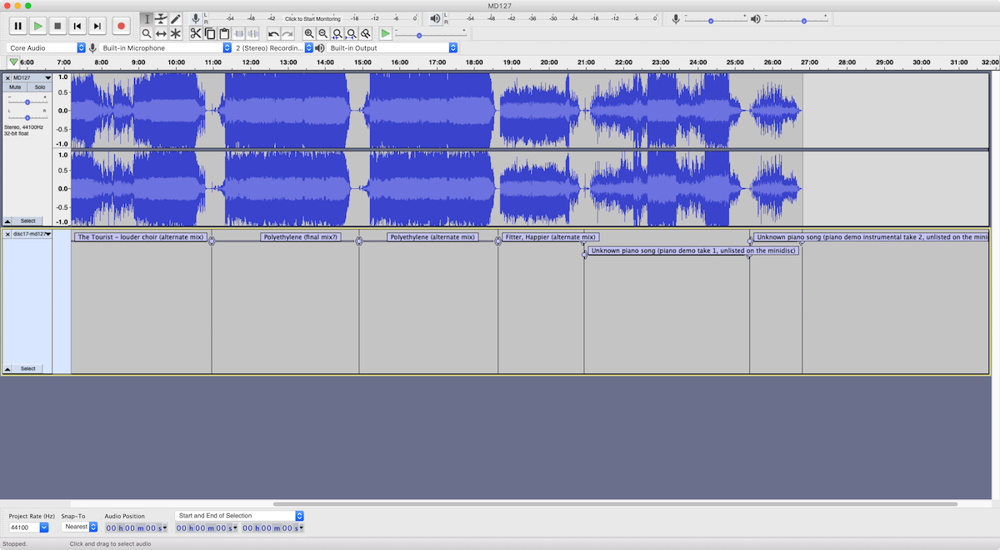

# okminidisc-splicing

## Background

On June 11 2019 Radiohead released a bunch of music that had been stolen from them as a result of hacking activity. The [official release](https://radiohead.bandcamp.com) of the stolen music (a total of 18 minidiscs) was made available for with the proceeds going to [Extinction Rebellion.](https://rebellion.earth)

The collection was released as a series of files, one for each minidisc. I wanted to split the files up into tracks, treating each mini-disc as an album in the collection. I also wanted to do it in a way that I could make changes to the "albums" later when I have listened to everything and want to make changes to the outputted "albums". 

So I put together the process described below.

## Caveats

Yes, this could be scripted, but this process is non-programmatic mostly on purpose. The upside: No code, minimal dependencies/software to install, and you change/add steps (like tweaking the audio) easily. Downside: It's a bit tedious, but only a bit.

Yes, this process entails re-encoding the audio. Do it the right way or suffer consequences.

## Thank you, Reddit

Most of the track metadata I have in these files comes from the work of folks in r/Radiohead, [specifically, this thread](https://www.reddit.com/r/radiohead/comments/bwzag6/entire_ok_computer_sessions_have_been_leaked/). I hope this small contribution of mine is of some use to someone else.

## Requirements

- You need to [download this repository.](https://github.com/warrenallen/okminidisc-splicing/archive/master.zip)

- You also need the **official** recording downloads for this to work right, not the original leaked files. **No audio is available in this repository.**

- You only need [Audacity](https://www.audacityteam.org/download/) to make this work, and I don't see any reason why this won't work on all platforms.

- If you want to make substantial changes to the way the output tracks are created you probably want to use Excel (see below).

-  It shouldn’t matter which audio format you want to export, assuming that the lengths (and thus timestamps) are consistent across the file types, and assuming you have set up the necessary codecs.

## Steps to split up the tracks without any changes to the meta-data

For each of the original audio recordings:

1. Open the file in Audacity.

1. Import the appropriate labels file into Audacity: **File>Import>Labels**. With a little fiddling of the UI it will look like the screenshot below with the audio track and labels appearing in Audacity:

1. If you want to edit the audio, do it now. **Any changes to length (e.g., cutting out sections of the waveform) will mess up the timing of the tracks you export, so don’t do this.** If you want to create different tracks or trim the tracks, etc, see the steps below.

1. Export the tracks: **File>Export>Export Multiple...**

1. In the **Export Multiple** window, make sure the **Split files based on:** setting is set to **Labels.** Set the rest of the settings according to your desires.

1. Click Export and in a few seconds to a minute you should see a report of the successful export.

## Making changes to the outputted files

If you want to change the name of any tracks before processing them through Audacity, or you want to skip certain tracks, the simple way to do this is to edit the **Labels** files in a text editor.

- Make sure you keep them if UTF-8 encoding.
- Don't want to export all the tracks? If you delete a row entirely, then Audacity will not export that chunk of time.
- You can edit the start/stop time of each track, but there's a better way...

## Curating your own collection

If you want to make more substantial changes to the outputted tracks (e.g., trim them to specific timestamps, only export certain tracks...) open the Excel workbook to make changes.

- Change columns A:B to adjust what timestamps are used to cut audio files up. You do not have to account for every second of audio; anything that is outside of or between these ranges will not be processed by Audacity.
- Do not edit columns C:D. These columns calculate timestamps in plain seconds based on the HH:MM:SS timestamps in columns A:B.
- You can change the track names here.

To create a new label text file for any of the minidisc files, copy and paste columns C:E for the respective rows ([example](img/screenshot2.png)). Paste into the appropriate text file and re-run the steps above.
